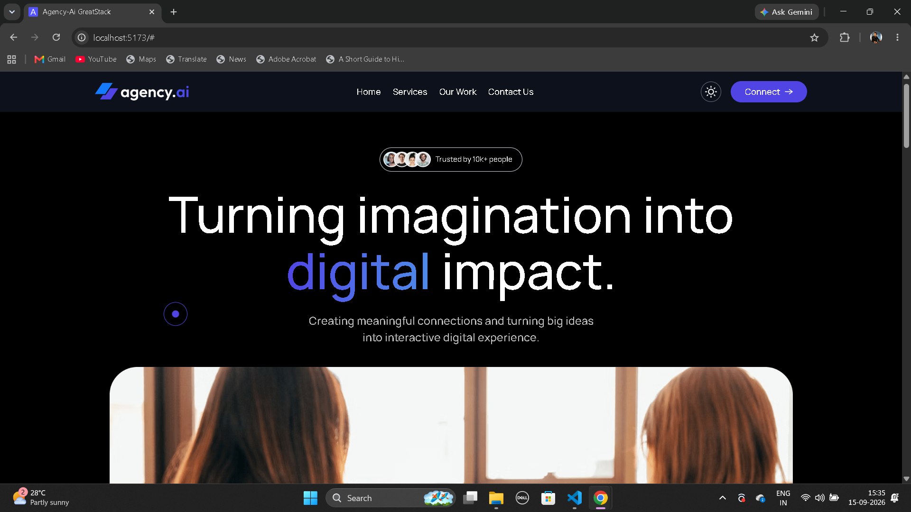
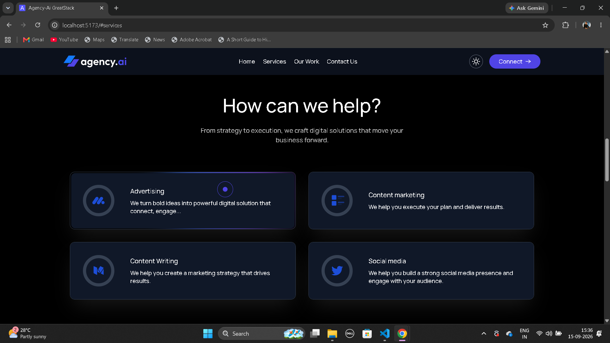
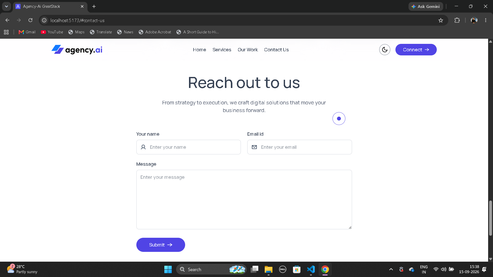
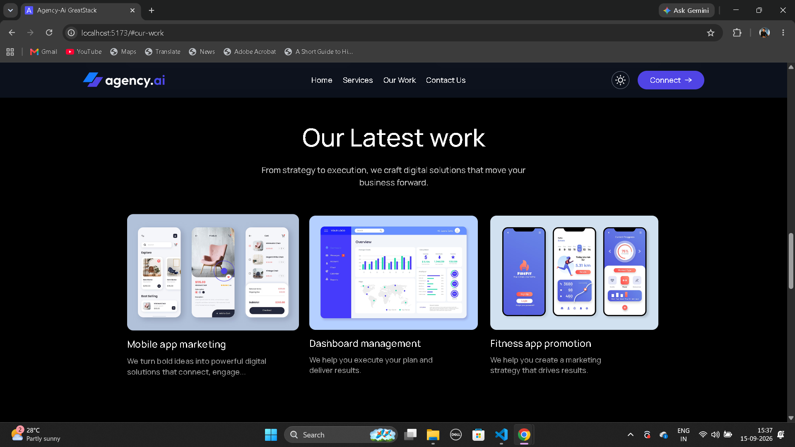

# Agency AI

A modern, responsive digital agency website built with **React, Vite, Tailwind CSS, and Motion**. The project focuses on a polished user experience with responsive layouts, interactive UI effects, dark/light theme support, reusable components, animations, and real contact-form API integration.

## 🌐 Live Demo
https://agency-ai-one-omega.vercel.app/

## 📸 Preview









---

## ✨ Features

* Fully responsive design for desktop, tablet, and mobile
* Modern single-page agency layout
* Light/Dark theme with persistent preference using `localStorage`
* Responsive navbar with mobile sidebar navigation
* Animated hero and section reveals
* Interactive service cards with mouse-follow gradient effects
* Custom animated cursor
* Dynamic services, portfolio, team, and company-logo rendering
* Responsive portfolio and team grids
* Contact form with asynchronous API submission
* Success/error feedback using toast notifications
* Smooth visual transitions and hover interactions
* Reusable and component-based React architecture

---

## 🛠️ Tech Stack

| Technology           | Usage                                        |
| -------------------- | -------------------------------------------- |
| **React 19**         | UI development and component architecture    |
| **Vite**             | Development server and build tooling         |
| **Tailwind CSS v4**  | Responsive utility-first styling             |
| **Motion**           | UI animations and viewport-based transitions |
| **React Hot Toast**  | Form submission notifications                |
| **Web3Forms**        | Contact form API integration                 |
| **JavaScript / JSX** | Application logic and UI                     |
| **ESLint**           | Code quality and linting                     |

---

## 🧠 React Concepts Implemented

* Functional components and component composition
* Props and reusable components
* `useState` for UI state management
* `useEffect` for side effects and event lifecycle management
* `useRef` for DOM references and interactive effects
* Conditional rendering
* Dynamic list rendering with `.map()`
* Event handling
* Form handling and submission
* Browser `localStorage`
* DOM interaction and coordinate calculations
* Asynchronous API requests with `fetch()`

---

## 🎨 UI & Interaction

### Dark / Light Mode

The application supports both light and dark themes. The selected theme is applied through the `dark` class and persisted using browser `localStorage`.

### Interactive Service Cards

Service cards feature a custom mouse-follow gradient effect. Mouse coordinates are calculated relative to each card using DOM measurements and React state, creating a dynamic hover interaction.

### Custom Cursor

A custom cursor is implemented using `useRef`, mouse events, and `requestAnimationFrame()` to provide a smooth pointer-following animation.

### Motion Animations

The project uses Motion for:

* Scroll-triggered animations
* Fade and slide transitions
* Scale effects
* Staggered card animations
* Viewport-based section reveals

---

## 🔌 Contact Form Integration

The contact form is integrated with **Web3Forms** and uses the browser `fetch()` API for asynchronous submission.

```text
Form Input
    ↓
FormData
    ↓
POST Request
    ↓
Web3Forms API
    ↓
Success / Error Response
    ↓
Toast Notification
```

The form provides user feedback and resets after a successful submission.

---

## 🏗️ Project Structure

```text
src/
├── assets/
│   └── assets.js
│
├── components/
│   ├── Navbar.jsx
│   ├── Hero.jsx
│   ├── TrustedBy.jsx
│   ├── Services.jsx
│   ├── ServiceCard.jsx
│   ├── OurWork.jsx
│   ├── Teams.jsx
│   ├── ContactUs.jsx
│   ├── Footer.jsx
│   ├── Title.jsx
│   └── ThemeToggleBtn.jsx
│
├── App.jsx
├── App.css
├── index.css
└── main.jsx
```

The application is broken into reusable components, while repeated content such as services, portfolio items, team members, and company logos is rendered from structured data.

---

## 📱 Responsive Design

The interface follows a mobile-first responsive approach using Tailwind CSS breakpoints.

Responsive behavior includes:

* Desktop and mobile navigation
* Adaptive typography and spacing
* Responsive service, portfolio, and team grids
* Mobile sidebar menu
* Flexible content layouts
* Responsive hero section
* Mobile-friendly contact form

---

## 🚀 Getting Started

### Clone the repository

```bash
git clone https://github.com/aadityakute3010-ak/agency-ai.git
cd agency-ai
```

### Install dependencies

```bash
npm install
```

### Start development server

```bash
npm run dev
```

### Create production build

```bash
npm run build
```

### Run ESLint

```bash
npm run lint
```

---

## 🔮 Future Improvements

* Backend-powered contact management
* Newsletter subscription integration
* CMS-driven portfolio content
* SEO and Open Graph optimization
* Accessibility improvements
* Reduced-motion support
* Automated testing
* Analytics integration
* Image optimization and performance tuning

---

## 👨‍💻 Author

**Aditya Kute**

Java Full Stack Developer | React | Spring Boot

[GitHub](https://github.com/aadityakute3010-ak)
